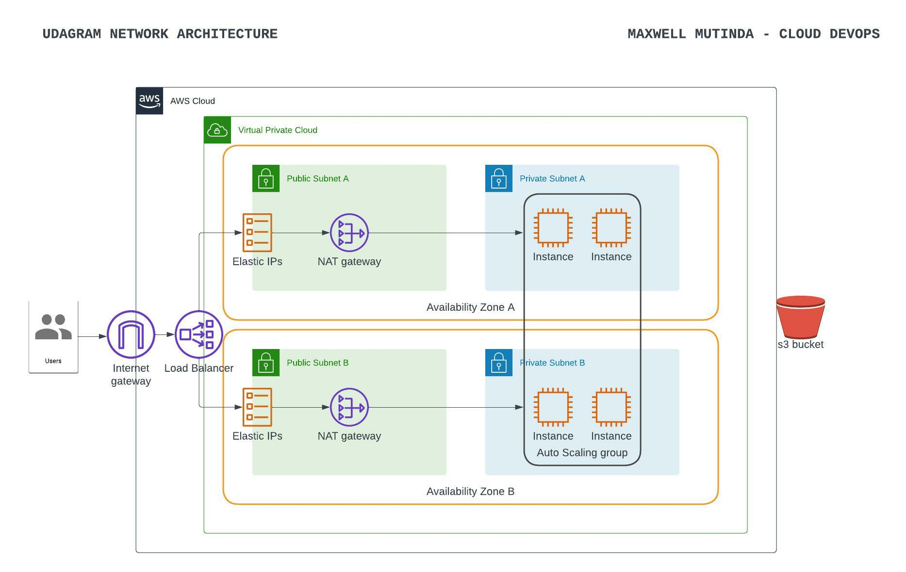

# Udagram Infra
Infra 

URL: http://udagr-webap-qtwjconehcfn-1387251987.us-east-1.elb.amazonaws.com/

## Shortcuts
How to provision, update and destroy resources
### Network
1. Create Network
```bash
    make create-network
```

2. Update Network
```bash
    make update-network
```

3. Delete Network
```bash
    make update-network
```

### Servers

1. Create Servers
```bash
    make create-servers
```

2. Update Servers
```bash
    make update-servers
```

3. Delete Servers
```bash
    make update-servers
```


## Infra Architecture

